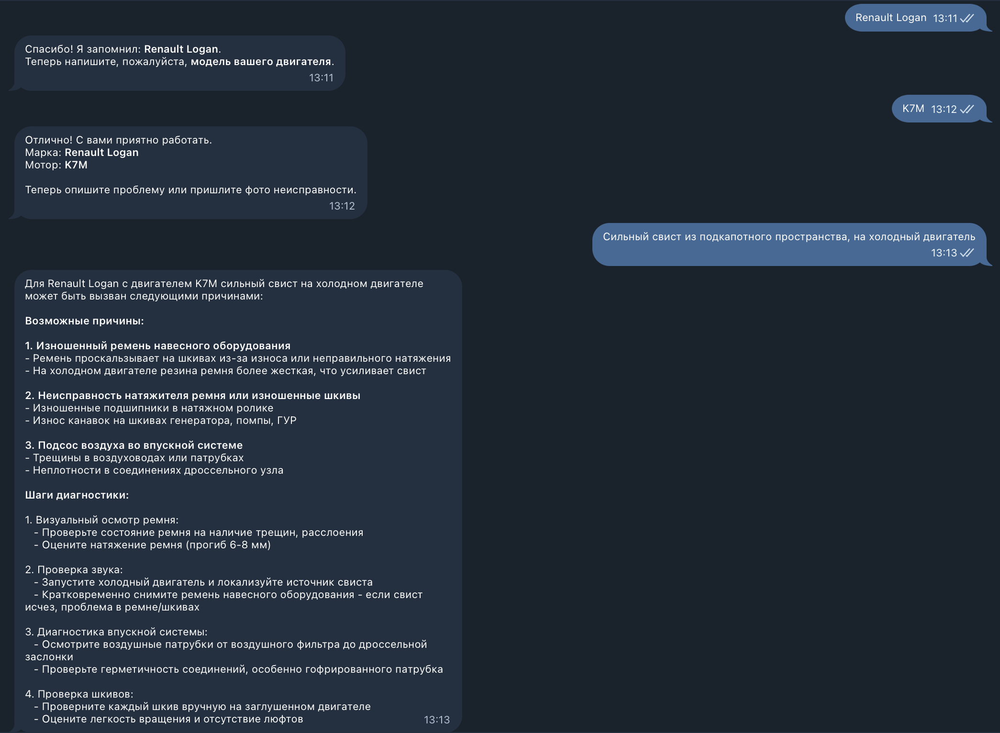
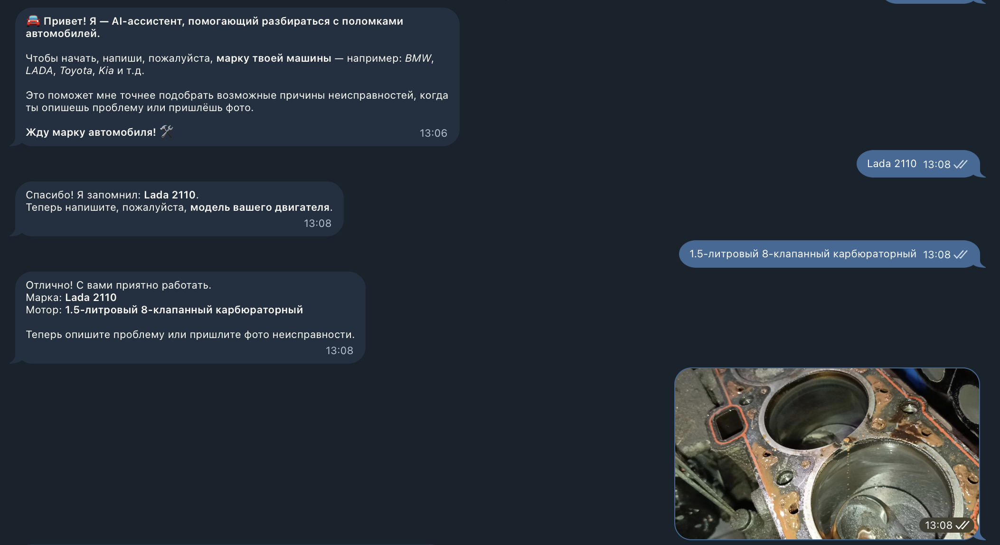
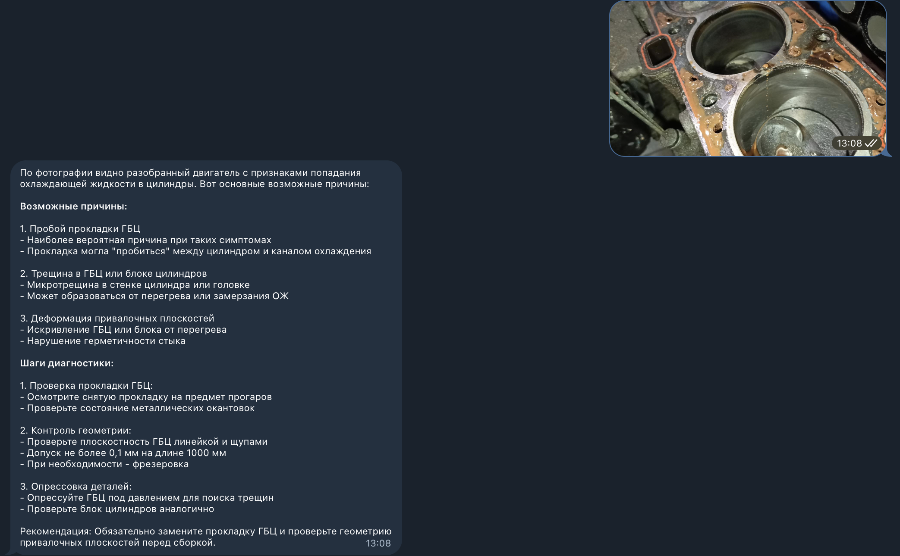
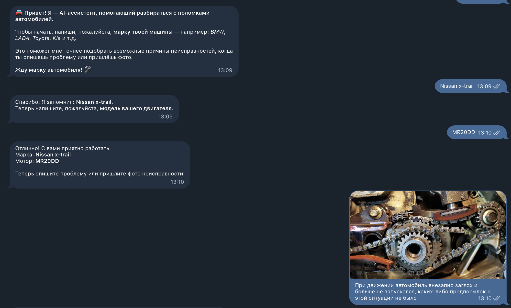
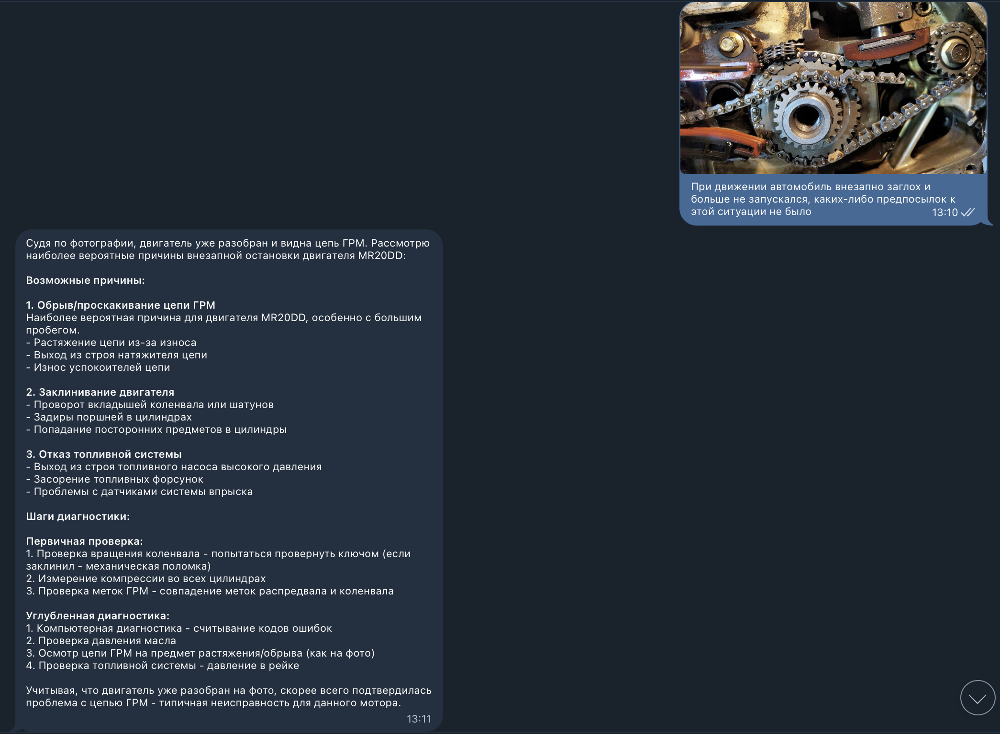

[Фото + описание](screenshots/logo.png)
# 🚗 DriverAssistant — Telegram-бот AI-диагностики авто

AI-ассистент помогает автовладельцам определить возможные причины неисправностей и предлагает шаги диагностики по описанию или фото. Под капотом — интеграция с OpenRouter и моделью Claude.

---

## 📦 Возможности

- Распознаёт проблемы по описанию от пользователя
- Умеет принимать и анализировать фотографии
- Поддержка комбинации: фото + текст
- Отвечает на естественном языке с анализом и шагами диагностики
- FSM логика сбора информации о марке и двигателе

---

## 🚀 Быстрый старт

1. Клонируй репозиторий:

   ```bash
   git clone https://github.com/your-username/driver-assistant.git
   cd driver-assistant
   ```

2. Установи зависимости:

   ```bash
   pip install -r requirements.txt
   ```

3. Создай файл `.env` и добавь ключи:

   ```env
   BOT_TOKEN=твой_токен_бота
   OPENROUTER_API_KEY=твой_api_ключ_OpenRouter
   ```

4. Запусти бота:
   ```bash
   python3 -m bot.main
   ```

---

## 🤖 Как работает бот

Бот ведёт пользователя через цепочку состояний:

1. Спрашивает марку авто
2. Спрашивает модель двигателя
3. Просит описать проблему или прикрепить фото

---

## 📸 Примеры использования

### 📄 Только текст



---

### 🖼 Только фото




---

### 🖼+📄 Фото + описание




---

## 🧠 Под капотом

- Python 3.9+
- Aiogram 3
- OpenRouter (Claude/Anthropic)
- FSM (Finite State Machine)
- Markdown и HTML форматирование ответов
- Обработка фото в base64

---

## 🛡 Лицензия

Проект открыт под лицензией MIT.

---

## 📬 Обратная связь

Пиши [в Issues](https://github.com/Leshawolf/driverassistant/issues) или открывай Pull Request!
- Email: Volchek903@gmail.com
- Telegram: [Ссылка](t.me/volchek903)
- Linkedin: [Ссылка](https://www.linkedin.com/in/volchek903/)
